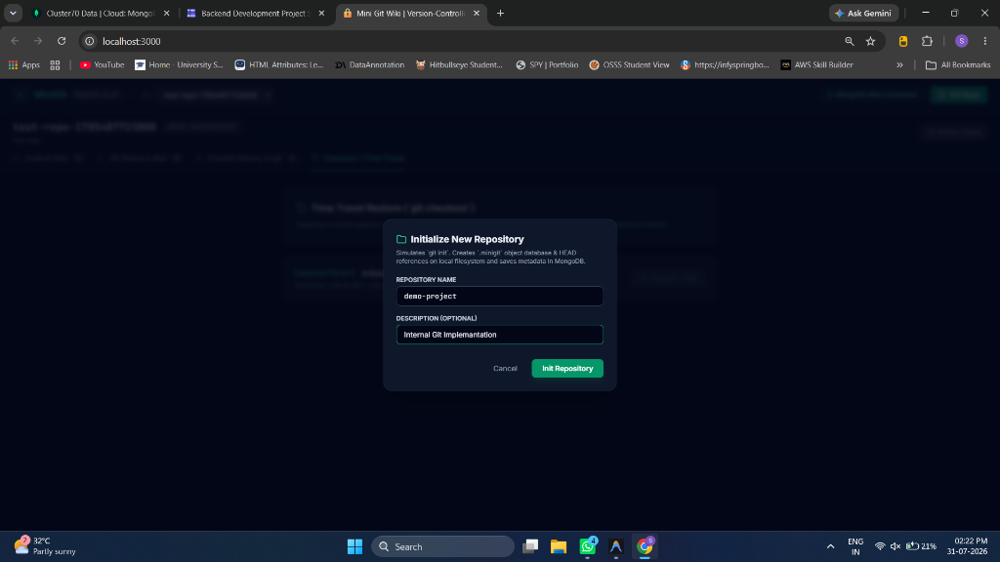
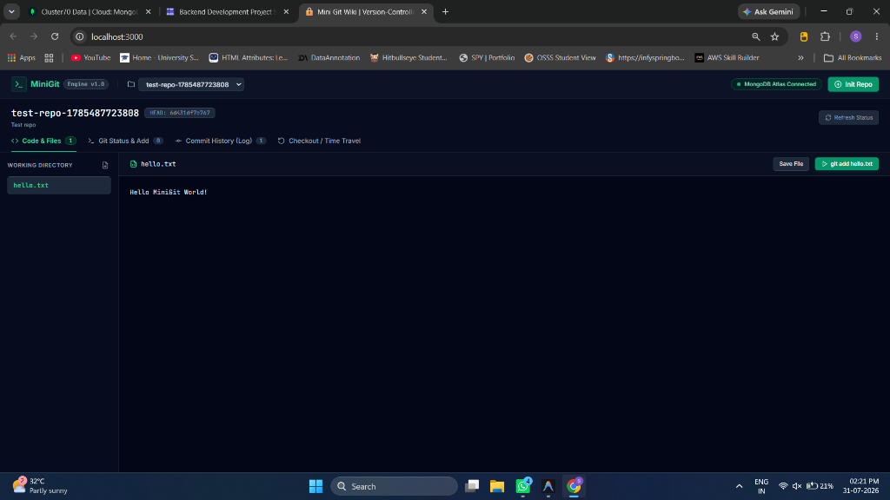
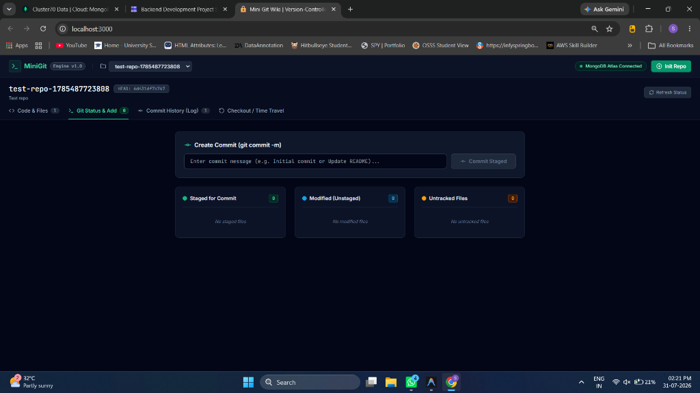
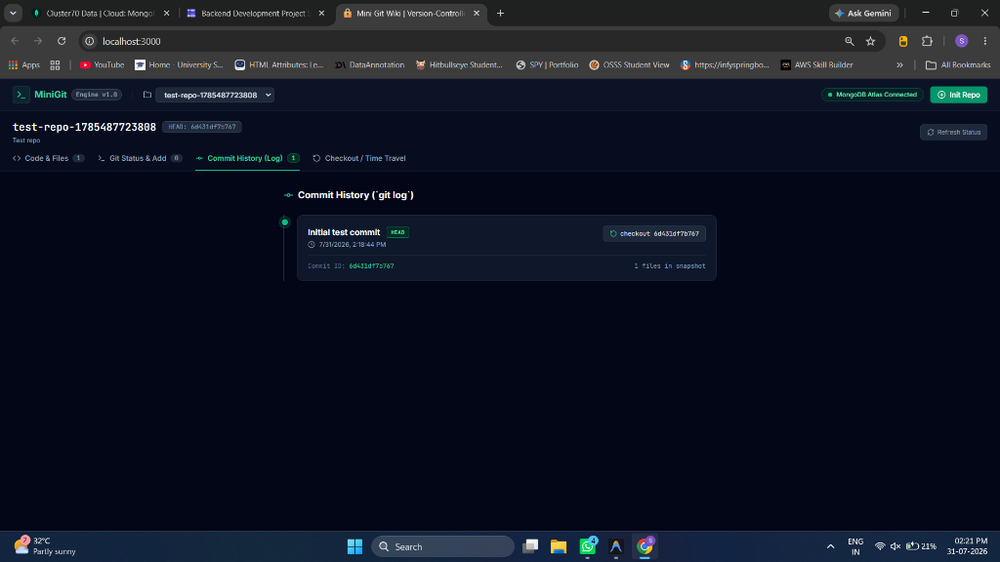
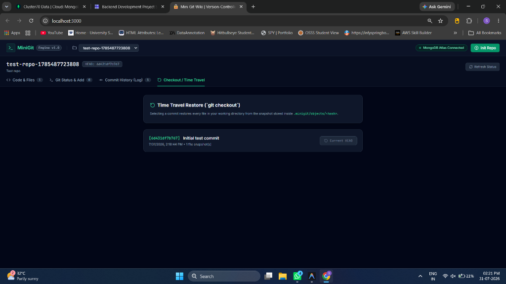

# 🚀 MiniGit - Full-Stack Internal Git Simulation Engine

> A full-stack MERN implementation of Git core internals (object storage, SHA-256 content hashing, staging index, commit trees, and HEAD reference tracking) **without using the native Git CLI**.

---

## 🌟 Overview

**MiniGit** is designed to demonstrate how Version Control Systems (VCS) operate under the hood. Instead of delegating tasks to system shell binaries or `git` CLI, **MiniGit** simulates Git's internal object store, staging index, commit snapshots, and time-travel checkout mechanism directly using **Node.js `fs` & `crypto` modules** combined with **MongoDB Atlas**.

---

## ✨ Features

- **⚡ Native Git Internals Simulation**: Implements object hashing, blobs, commits, HEAD pointers, and index files directly on local disk.
- **🔒 SHA-256 Hashing**: Generates unique hexadecimal content hashes for versioned objects and commit trees using Node's `crypto` module.
- **📂 Clean MVC & Service Architecture**: Modular codebase separating controllers, service logic, Mongoose models, and filesystem utilities.
- **☁️ MongoDB Atlas Metadata Persistence**: Stores repository metadata, commit histories, and active staging state for instant query performance.
- **🎨 GitHub-Inspired Dark UI**: Modern, responsive user interface built with React, Tailwind CSS, and Lucide icons.
- **⏮️ Time-Travel Checkout**: Instantly restore the entire working directory to any historical commit snapshot.

---

## 🛠️ Tech Stack

- **Frontend**: React.js, Tailwind CSS, Lucide React Icons, Vite
- **Backend**: Node.js, Express.js
- **Database**: MongoDB & Mongoose (Cloud Atlas / Local)
- **Hashing Engine**: SHA-256 via Node `crypto`
- **File System**: Node `fs/promises` for `.minigit` object database management

---

## 📁 `.minigit` File System & Object Store Architecture

When a repository is initialized (`POST /api/repos/init`), MiniGit generates a `.minigit` directory structure inside `server/repositories/<repoId>/`:

```text
server/repositories/<repoId>/
├── .minigit/
│   ├── objects/           # Content blobs stored by SHA-256 hash (e.g. cea8d7ed66...)
│   ├── commits/           # JSON commit snapshots stored by commitId (e.g. 6d431df7b767.json)
│   ├── HEAD               # Text file storing active commitId (e.g. 6d431df7b767)
│   └── index.json         # Staging index map ({ [filename]: hash })
└── [Working Directory Files] (e.g. README.md, src/index.js)
```

---

## 🛠️ Implemented Core Commands & Workflows

### 1. `init` — Initialize Repository
- **API**: `POST /api/repos/init`
- **Action**: Creates MongoDB repository record and generates `.minigit/` directory structure with `objects/`, `commits/`, `HEAD`, and `index.json`.

### 2. `add` — Stage Files
- **API**: `POST /api/repos/:repoId/add`
- **Action**: Reads file content, generates SHA-256 hash, stores raw content in `.minigit/objects/<hash>`, updates `.minigit/index.json`, and records staged state in MongoDB `Stage` collection.

### 3. `status` — Repository Status
- **API**: `GET /api/repos/:repoId/status`
- **Action**: Compares current working directory files against `.minigit/index.json` (staged) and active `HEAD` commit snapshot. Returns categorized `staged`, `modified`, and `untracked` files.

### 4. `commit` — Create Snapshot
- **API**: `POST /api/repos/:repoId/commit`
- **Action**: Generates a unique `commitId` (SHA-256 hash), captures snapshot of staged items from `index.json`, saves `.minigit/commits/<commitId>.json`, updates `.minigit/HEAD`, clears staging area, and persists commit record in MongoDB `Commit` collection.

### 5. `log` — Commit History
- **API**: `GET /api/repos/:repoId/log`
- **Action**: Fetches complete commit history sorted chronologically (latest first).

### 6. `checkout` — Time Travel / Restore
- **API**: `POST /api/repos/:repoId/checkout`
- **Action**: Cleans working directory, restores files from `.minigit/objects/<hash>` referenced in target commit snapshot, and updates `HEAD` pointer.

---

## 🗄️ Database Schemas (MongoDB)

### 1. `Repository` Collection
```json
{
  "name": "demo-project",
  "description": "Demonstration MiniGit repository",
  "createdAt": "2026-07-31T14:00:00.000Z"
}
```

### 2. `Commit` Collection
```json
{
  "repositoryId": "66a9...",
  "commitId": "6d431df7b767",
  "parentCommit": "3a189f...",
  "message": "Initial commit",
  "timestamp": "2026-07-31T14:05:00.000Z",
  "files": [
    { "filename": "hello.txt", "hash": "cea8d7ed665d153bb93bb76342f821060821f951004e4f9d2f5f1ebe72a6c5bd" }
  ]
}
```

### 3. `Stage` Collection
```json
{
  "repositoryId": "66a9...",
  "filename": "hello.txt",
  "hash": "cea8d7ed665d153bb93bb76342f821060821f951004e4f9d2f5f1ebe72a6c5bd"
}
```

---

## 🚀 Quick Start & Installation

### Prerequisites
- Node.js (v18+)
- npm or yarn
- MongoDB Atlas URI or Local MongoDB instance

### 1. Clone & Install Dependencies

```bash
# Clone the repository
git clone https://github.com/YOUR_USERNAME/MiniGit.git
cd MiniGit

# Install Server dependencies
cd server
npm install

# Install Client dependencies
cd ../client
npm install
```

### 2. Environment Setup

Create a `.env` file inside the `server/` directory:

```env
PORT=5000
MONGODB_URI=your_mongodb_atlas_connection_string
JWT_SECRET=your_secret_jwt_key
```

### 3. Start Development Servers

```bash
# In server directory:
npm run dev

# In client directory (separate terminal):
npm run dev
```

Open your browser at **`http://localhost:3000`**.

---

## 📸 Screenshots & UI Workflow

### 1. Initialize Repository (`git init`)
Simulates `git init` by creating `.minigit` object storage and HEAD reference on disk & MongoDB.


### 2. Code & Working Directory Workspace
Create, view, and edit files in your working directory with quick `git add` actions.


### 3. Git Status & Staging Panel (`git status` & `git add`)
Categorized status badges (`Staged`, `Modified`, `Untracked`) and `git commit -m` executor.


### 4. Commit History Timeline (`git log`)
Visual `git log` timeline showing commit IDs, parent hashes, messages, timestamps, and snapshots.


### 5. Time Travel & Restore (`git checkout`)
One-click historical repository restoration back to any previous commit snapshot.


---

## 📜 License

Distributed under the MIT License. See `LICENSE` for details.
